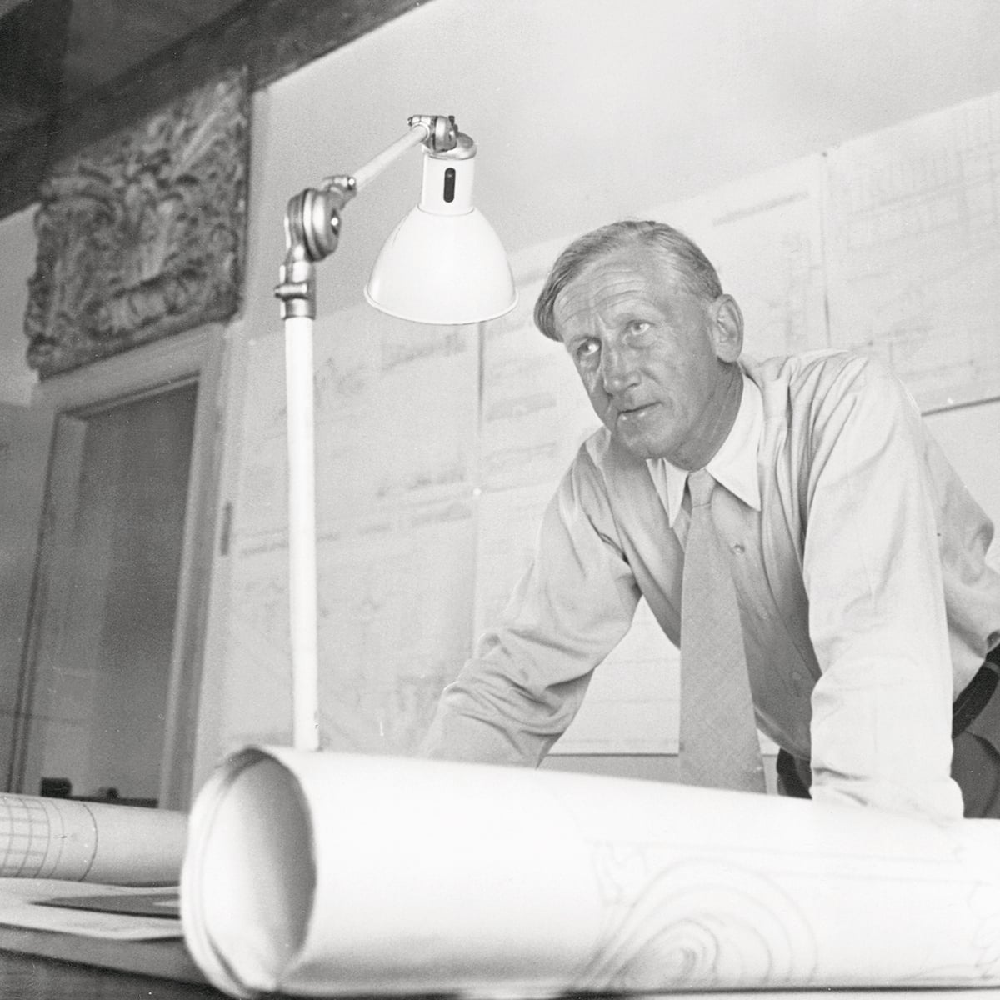
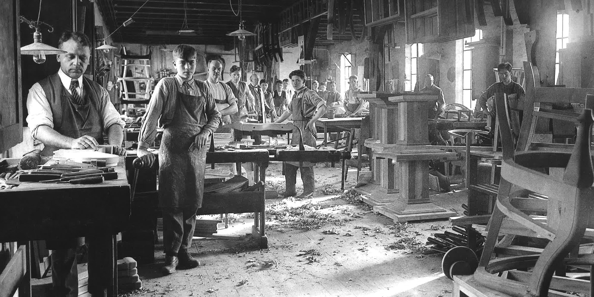
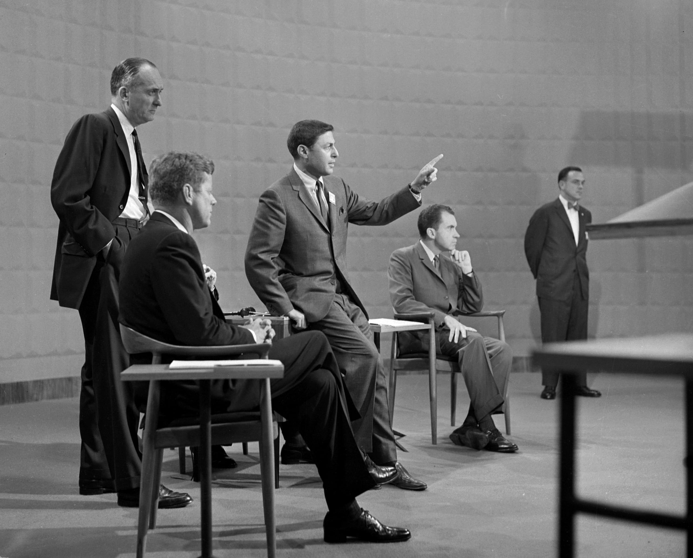
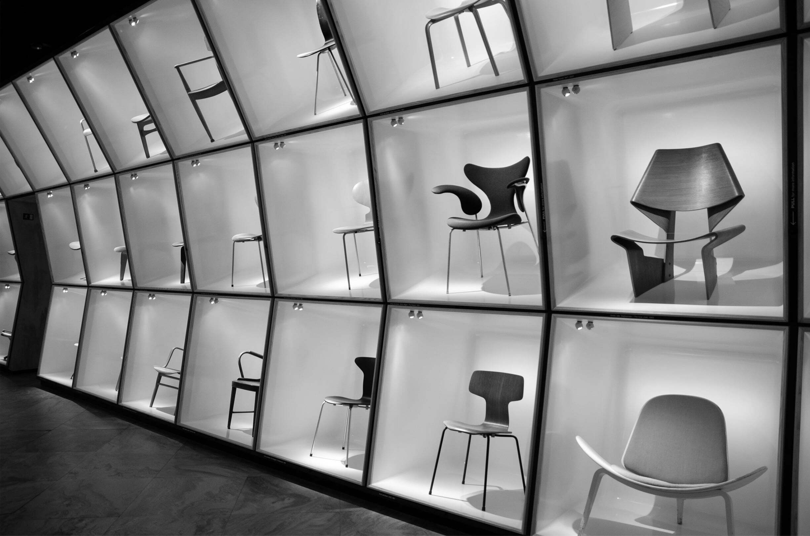

# Timeline

## Origins, 1920

Between the two world wars, [Kaare Klint](https://en.wikipedia.org/?search=Kaare+Klint) exerted a strong influence on Danish furniture making. Appointed head of the Furniture Department at the Architecture School of the Royal Danish Academy of Fine Arts, he encouraged his students to take an analytical approach, adapting design to modern-day needs.

Adopting the Functionalist trend of abandoning ornamentation in favor of form, he nonetheless maintained the warmth and beauty inherent in traditional Danish cabinet making, as well as high-quality craftsmanship and materials.

## Start of the Golden Age, 1945

In the postwar years, Danish designers and architects believed that design could be used to improve people’s lives. In the late 1940s, the growing middle class in Denmark began to show interest in Danish Modern and helped fuel further investment into the style.

Particular attention was given to creating affordable furniture and household objects that were both functional and elegant. Fruitful cooperation ensued, combining Danish craftsmanship with innovative design. Initially, the furniture was handmade, but recognizing that their work would sell better if prices were reduced, the designers soon turned to factory production.

## The International Market, 1950

Interest in Danish Modern in the United States began when [Edgar Kaufmann, Jr.](https://en.wikipedia.org/wiki/Edgar_Kaufmann_Jr.) from the Museum of Modern Art purchased some items for the [Fallingwater](https://en.wikipedia.org/wiki/Fallingwater) home designed by [Frank Lloyd Wright](https://en.wikipedia.org/wiki/Frank_Lloyd_Wright).

One of Wegner‘s works was used by Richard Nixon and John F. Kennedy in a [1960 televised debate](https://www.youtube.com/watch?v=AYP8-oxq8ig) and is now known simply as “The Chair”.

## Decline in Popularity, 1960

Sales peaked around 1963, but when American manufacturers introduced moulded plastic and wood-grained Formica as cheaper substitutes, they started to decline in favor of “Mediterranean” designs which became popular in 1966. In addition to changes in style preferences, customers shopping habits had changed to favor affordable and lower-cost furniture over a single investment that would last their lifetime.

Many factories closed during this time and the Cabinetmakers’ Guild Exhibition held its final event in 1966 after too few cabinetmakers remained in Copenhagen to sustain it. In 1980, the New York Times noted:

> Danish furniture went out of style. After being widely acclaimed and acquired, it was copied and cheapened and then replaced by those whose business is marketable novelty and change.

## Resurgence of Interest, 1990

In the late 1990s, Danish modern, and the broader mid-century modern movement, experienced a revival in international interest.

While the mass-produced works of [Wegner](https://en.wikipedia.org/wiki/Hans_Wegner), [Juhl](https://en.wikipedia.org/wiki/Finn_Juhl) and [Jacobsen](https://en.wikipedia.org/wiki/Arne_Jacobsen) are still in demand, collectors are increasingly turning to limited production items from these and the other designers. Licensed manufacturers have started reissuing key designs, while others have used Danish Modern for inspiration.
